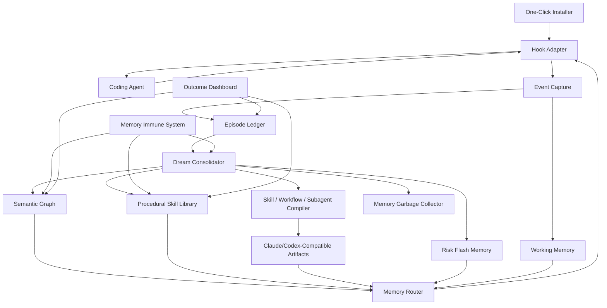

# Human-Inspired Agent Memory OS 产品需求文档

## 1. 产品一句话

构建一个可一键接入 Claude 与 Codex 的外置大脑：通过 hook 捕获任务经历，通过 Claude Skill 兼容协议产出可复用 skill、workflow、subagent，让 Agent 像人类工程师一样从经验中持续进化。

## 2. 产品定位

这不是单一向量库、聊天历史、规则文件或 prompt 增强器，而是一个面向 Claude 与 Codex 的 Coding Agent Memory OS。

它运行在 Agent 与代码库、终端、测试、CI、PR、文档、用户反馈之间，通过标准 hook 捕获任务经历，通过后台巩固生成可复用经验，并在未来任务的关键时机把正确记忆注入给 Agent。

产品输出不只是 memory item，还包括三类可执行资产：

- Skill：兼容 Claude Skill / Open Agent Skills 风格的目录协议，包含 `SKILL.md`、references、scripts、assets，让 Agent 能按需加载专业能力。
- Workflow：可由 hook、命令、CI 或 Agent 调用的多步骤流程，包含触发条件、步骤、验证和回滚。
- Subagent：带角色、工具权限、预加载 skills、记忆范围和任务边界的可派遣专家 Agent。

目标形态：

- 对 Claude Code / Claude API：兼容 Claude Skill、hooks、subagents 的文件和配置习惯。
- 对 Codex CLI / IDE / App：兼容 Codex Agent Skills、hooks、custom agents、AGENTS.md / rules 等持久化面。
- 对个人开发者：让 Agent 逐步理解个人偏好、项目习惯、常见坑和工作风格。
- 对团队：沉淀 team memory、事故记忆、架构规则、技能库和可信来源。
- 对组织：提供权限、审计、治理、回滚和评测，防止长期记忆污染。

## 3. 背景问题

当前主流 Coding Agent 的 memory 多停留在以下形态：

- 长上下文或会话历史。
- `AGENTS.md`、`CLAUDE.md`、rules、memory bank 等静态项目笔记。
- 向量检索增强。
- 手写 workflow、hook、command。

它们有价值，但缺少类似人类记忆的关键能力：

- 不知道什么值得长期记。
- 不能可靠记录一次任务的完整 episode。
- 难以把多次经历巩固成规则和技能。
- 召回过度依赖语义相似，而非任务、风险、路径、因果和角色。
- 缺少遗忘、再巩固、版本、来源和可信度。
- 容易被 prompt injection、错误总结、坏习惯污染。
- 很难证明某条记忆是否真的改善了行动。

## 4. 产品目标

### 4.1 北极星目标

让接入后的 Coding Agent 在同一用户、同一项目、同一团队中持续进化：重复错误更少、定位问题更快、上下文恢复更稳、用户重复提醒更少、团队经验沉淀更可靠。

### 4.2 可量化目标

MVP 阶段目标：

- 重复错误率下降：同类错误二次发生率降低 30%。
- 用户重复提醒下降：相同偏好或规则重复说明次数降低 40%。
- 任务恢复能力提升：中断后恢复任务的成功率提升 30%。
- 关键记忆召回命中率：高风险任务前召回相关风险记忆的准确率达到 80%。
- 记忆污染控制：未经验证的高风险记忆不得自动进入 team memory 或 skill library。

## 5. 目标用户

### 5.1 个人开发者

希望 Agent 记住项目命令、测试习惯、偏好、历史坑、常见 workflow，而不是每次从零解释。

### 5.2 团队 Tech Lead / Staff Engineer

希望把团队经验沉淀为可验证、可维护、可审计的规则和技能，减少部落知识和重复事故。

### 5.3 安全 / 平台 / DevEx 团队

希望为所有 Coding Agent 提供统一的记忆治理、hook 接入、安全隔离、审计和评测基础设施。

### 5.4 Coding Agent 提供商 / 插件开发者

希望用一个标准协议接入长期记忆，而不是为每个 Agent 单独实现 memory。

## 6. 核心用户故事

1. 作为开发者，我希望 Agent 在修完一次 bug 后记住关键失败路径和验证方式，下次遇到相似问题时不要重复试错。
2. 作为团队成员，我希望 Agent 能把多次任务经历提炼成项目事实、架构规则、已知坑和可复用 workflow。
3. 作为 reviewer，我希望 Agent 修改高风险代码时自动召回相关事故、权限边界和测试要求。
4. 作为平台团队，我希望不同 Agent 都能通过 hook 接入同一套 memory，不依赖某个 agent vendor。
5. 作为安全负责人，我希望外部文档、日志或 PR 评论不能通过 prompt injection 写入长期记忆。
6. 作为团队负责人，我希望看到哪些记忆真的减少了错误，哪些记忆已经过期或造成误导。
7. 作为 Agent 使用者，我希望只运行一条命令就能把 Memory OS 接到 Claude Code 或 Codex。
8. 作为 Agent 使用者，我希望系统能把反复出现的成功流程自动沉淀成 Claude Skill 风格的 `SKILL.md`，让 Agent 下次自动加载。
9. 作为团队平台负责人，我希望系统能根据团队经验生成 reviewer、security、release、debugger 等 subagent，并为它们预加载对应 skills。

## 7. 产品原则

1. 行动优先：记忆的价值由未来行动改善衡量，而不是存储量衡量。
2. 证据优先：每条长期记忆都必须有来源、证据、置信度和适用范围。
3. 默认隔离：个人、项目、团队、组织、角色、环境之间默认隔离，显式晋升。
4. 可修订：记忆必须支持更新、降权、废弃、回滚和过期复核。
5. 可触发：好的记忆不只是被搜索到，而是在正确时机主动影响行动。
6. 可治理：高风险记忆、team rule、skill、hook 必须有审批和审计。
7. Claude/Codex 优先：MVP 只支持 Claude 与 Codex，避免为了泛化牺牲核心体验。
8. Skill-first：稳定经验优先沉淀为 Claude Skill / Open Agent Skills 兼容资产，而不是只写入不可执行的知识库。
9. 一键接入：用户不应手写复杂 hook 配置；系统应自动检测 Agent、生成配置、校验安装并提供回滚。

## 8. 系统架构



核心链路：

1. 一键安装器检测当前项目和可用 Coding Agent，写入对应 hook 配置。
2. Hook Adapter 在 Agent 生命周期中捕获事件，并把结构化事件送入 Event Capture。
3. Episode Ledger 保存完整任务经历，Dream Consolidator 在任务结束或空闲时做巩固。
4. Semantic Graph 保存事实、规则、风险、来源和适用范围。
5. Procedural Skill Library 保存可执行经验，Compiler 将成熟经验编译成 Claude Skill、workflow 或 subagent。
6. Memory Router 根据当前任务、角色、路径、风险和 Agent 能力，选择注入记忆、调用 skill、触发 workflow 或派遣 subagent。

## 9. Hook 接入模型

### 9.1 接入目标

通过最少侵入方式接入 Claude 与 Codex。Agent 不需要内建 memory，只需要在关键生命周期事件上调用本产品提供的 hook CLI、HTTP API、local daemon 或 MCP server。

### 9.2 标准 hook 生命周期

| Hook | 触发时机 | 主要用途 |
|---|---|---|
| `session.start` | Agent 会话开始 | 获取用户、项目、角色、最近状态、可用 memory profile |
| `task.intent` | 用户目标明确或更新 | 建立 episode，抽取目标和验收标准 |
| `plan.before` | Agent 制定计划前 | 注入相关规则、风险、失败路径、workflow |
| `tool.before` | 执行命令/编辑/网络/PR 前 | 风险检查、前瞻记忆触发、policy gate |
| `tool.after` | 工具执行后 | 记录观察结果、错误、测试输出、diff |
| `file.changed` | 文件变更后 | 抽取路径 cue，检查相关规则和测试要求 |
| `test.after` | 测试或 CI 后 | 记录验证结果、失败根因候选 |
| `review.after` | PR review 或用户纠正后 | 提升用户反馈和团队规则候选 |
| `task.end` | 任务结束 | 生成 episode summary、候选记忆、候选 skill |
| `idle.consolidate` | 空闲或定时 | 离线巩固、压缩、去重、冲突、遗忘 |

### 9.3 Hook 返回动作

Hook 不只返回文本，也返回结构化动作：

```yaml
action:
  type: inject_context | remind | ask_user | run_check | block | create_todo | propose_memory
  priority: low | medium | high | critical
  reason:
  evidence:
  payload:
```

示例：

```yaml
action:
  type: remind
  priority: high
  reason: "当前修改 auth middleware，匹配 2026-05-18 权限绕过事故记忆"
  payload:
    checklist:
      - "检查匿名用户路径"
      - "运行 auth contract tests"
      - "确认 audit log 未丢失"
```

### 9.4 一键接入体验

用户入口：

```bash
memory-os init
memory-os init --agent claude-code --scope project
memory-os init --agent codex --scope project
memory-os init --agent auto --scope team --with-skills --with-subagents
memory-os doctor
memory-os uninstall --rollback
```

一键接入必须完成：

1. 检测当前目录是否为 git repo、monorepo、package 或普通项目。
2. 检测可用 Coding Agent：Claude Code 与 Codex。
3. 生成本地 daemon 配置和项目 memory 目录。
4. 写入对应 Agent 的 hook / rules / skill / MCP 配置。
5. 创建初始 memory profile：个人、项目、团队、角色。
6. 运行 smoke test：触发一次 `session.start` 和 `plan.before`，确认 Agent 能收到记忆。
7. 保存 install manifest，支持精确回滚。

安装产物示例：

```text
.memory-os/
  config.yaml
  install-manifest.json
  episodes/
  memories/
  skills/
  workflows/
  subagents/
  audit-log.jsonl

.claude/
  skills/
    memory-os/
      SKILL.md
  agents/
    memory-reviewer.md
    memory-security.md
  settings.local.json

.agents/
  skills/
    memory-os/
      SKILL.md

.codex/
  hooks.json
  agents/
    memory-reviewer.toml
    memory-security.toml
```

### 9.5 Claude Code 原生映射

Claude Code 是 MVP 的两个优先适配目标之一，因为它同时具备 hooks、skills、subagents 和 memory-like 文件约定。

映射策略：

| Memory OS 概念 | Claude Code 映射 |
|---|---|
| Hook Adapter | `settings.json` / `settings.local.json` 中的 hook 配置 |
| Skill Artifact | `.claude/skills/<skill-name>/SKILL.md` |
| Project Skill | 项目内 `.claude/skills/` |
| Personal Skill | `~/.claude/skills/` |
| Subagent Profile | `.claude/agents/<agent-name>.md` |
| Subagent Skill Preload | subagent frontmatter 的 `skills` 字段 |
| Subagent Memory | `.claude/agent-memory/<agent-name>/` 或相关 scope |
| Project Context | `CLAUDE.md` / `.claude/CLAUDE.md` 的受控生成片段 |

Claude Code 适配器需要支持：

- 自动写入 hooks，而不是要求用户手写 JSON。
- 将成熟 workflow 编译为 skill，而不是只注入 prompt。
- 将稳定角色经验编译为 subagent，并预加载相关 skills。
- 对高风险 hook 使用提醒或阻断，对判断性检查使用 prompt/agent-based hook。
- 保证生成的 `.claude/*` 文件可审计、可回滚、不会覆盖用户已有配置。

### 9.6 Codex 原生映射

Codex 是 MVP 的第二个一等适配目标。Codex 支持 Agent Skills、hooks、custom agents、AGENTS.md、rules、MCP 等持久化和扩展面，因此 Memory OS 要为 Codex 提供原生安装、原生资产输出和原生 hook 配置。

映射策略：

| Memory OS 概念 | Codex 映射 |
|---|---|
| Hook Adapter | `.codex/hooks.json` 或 `.codex/config.toml` 中的 hooks |
| Skill Artifact | `.agents/skills/<skill-name>/SKILL.md` |
| Project Guidance | `AGENTS.md` 的受控生成片段 |
| Rules / Memory Hints | `.codex/rules` 或 Codex 规则面，按实际版本能力落地 |
| Custom Agent | `.codex/agents/<agent-name>.toml` |
| Plugin Packaging | 后续可打包为 Codex plugin，包含 skills、hooks、MCP 配置 |

Codex 适配器需要支持：

- 自动写入 `.codex/hooks.json`，并保留 install manifest 以便回滚。
- 将成熟 skill 编译到 `.agents/skills/<skill-name>/SKILL.md`。
- 将稳定角色专家编译为 `.codex/agents/<agent-name>.toml`。
- 用 Codex hooks 捕获 `SessionStart`、`UserPromptSubmit`、`PreToolUse`、`PostToolUse`、`Stop` 等关键事件。
- 对需要用户信任的 hook，显示明确的来源、目的、命令和回滚方式。
- 生成的 Codex 资产与 Claude 资产共享同一套 `memory-os.meta.yaml` 元数据。

## 10. 核心模块需求

### 10.0 模块协作链路

核心模块围绕“经历 -> 记忆 -> 能力 -> 行动”运转：

```text
hook event
  -> Episode Ledger
  -> Memory Admission Controller
  -> Dream Consolidator
  -> Semantic Graph / Skill Library / Workflow Library / Subagent Registry
  -> Memory Router
  -> hook injection / skill invocation / workflow run / subagent dispatch
  -> Outcome Dashboard
```

每个模块都必须输出结构化证据，避免“总结看起来对，但无法追溯”。任意自动生成的 skill、workflow、subagent 都必须能追溯到 source episodes、验证结果、审批状态和最近使用效果。

### 10.1 Memory Admission Controller

决定哪些信息有资格成为候选记忆。

功能需求：

- 从对话、diff、命令、测试、CI、review、用户纠正中抽取候选。
- 为候选记忆打分：目标相关性、后果强度、新颖性、重复性、用户纠正、可触发性、证据质量、适用边界。
- 低价值信息只保留在短期 episode，不进入长期记忆。
- 高风险或来源不可信信息进入 quarantine。

设计细节：

- 输入：hook event、tool output、diff、test report、user correction、review comment。
- 处理：抽取候选 claim，判断 claim 类型，补齐 source、scope、evidence、confidence。
- 输出：`memory_candidate`、`skill_candidate`、`workflow_candidate`、`subagent_candidate`。
- 拒绝条件：无来源、无未来触发场景、只是临时噪声、来自不可信外部指令、会改变安全策略但未验证。
- 人机协作：低风险个人偏好可自动保存；团队规则、技能、hook、subagent 必须进入审批队列。

### 10.2 Episode Ledger

保存每次任务的结构化经历。

核心字段：

```yaml
episode_id:
agent_id:
user_id:
repo:
branch:
time_range:
task_goal:
acceptance_criteria:
initial_context:
plan:
trajectory:
  - action:
    observation:
    interpretation:
    next_action:
artifacts:
  diffs:
  commands:
  tests:
  links:
outcome:
decision_rationale:
failed_attempts:
counterfactual:
candidate_memories:
```

设计细节：

- Episode 是所有长期学习的原材料，不能被摘要替代。
- 每个 episode 记录 agent 当时为什么这么判断，而不只记录发生了什么。
- 支持事件边界：目标变化、repo 变化、风险等级变化、用户意图变化时创建 checkpoint。
- 支持 failed attempts：保存看起来合理但失败的路径，用于生成 anti-pattern skill。
- 支持 replay：Dream Consolidator 可回放 episode，提炼事实、规则、workflow 和 subagent 专长。

### 10.3 Semantic Graph

存储项目事实、架构规则、风险、偏好、适用范围和来源关系。

功能需求：

- 支持 claim、source、scope、confidence、validity、version。
- 支持记忆冲突检测。
- 支持 graph query：模块、命令、错误、规则、事故、owner、skill 之间的关系。
- 支持从 episode 自动生成候选 semantic memory。

设计细节：

- 节点：repo、module、file、symbol、command、test、error、incident、person、agent、skill、workflow、subagent、rule。
- 边：depends_on、caused_by、verified_by、supersedes、owned_by、applies_to、not_apply_when、generated_from。
- 查询：当前任务会先抽取 path、symbol、error、risk、role 等 cue，再做图查询和向量查询混合召回。
- 冲突：新 claim 与旧 claim 冲突时，不直接覆盖，进入 reconsolidation workflow。
- 失效：代码路径删除、依赖升级、测试迁移、owner 变更会触发相关记忆复核。

### 10.4 Procedural Skill Library

把重复成功经验变成可执行技能。

功能需求：

- 自动发现重复 workflow。
- 生成 skill card：触发条件、步骤、命令、验证方式、失败处理、适用边界。
- 支持 skill 晋升流程：candidate -> reviewed -> active -> deprecated。
- 支持把稳定 skill 提升为 hook、command、CI check 或团队规范。
- 支持 bad skill rollback。

设计细节：

- Skill 不等于知识条目，而是可被 Agent 使用的能力包。
- Skill 来源必须是多个成功 episode、一次高价值人工确认、或经过验证的团队规范。
- Skill 包含触发条件、步骤、脚本、参考资料、验证、失败处理和撤销路径。
- Skill 可作为普通记忆被召回，也可被编译为 Claude Skill 或 Codex Agent Skill 目录。
- Skill 必须记录 outcome：使用次数、成功率、误触发率、用户拒绝率、最近验证时间。

Skill 兼容格式：

```text
<skill-name>/
  SKILL.md
  references/
  scripts/
  assets/
  tests/
  memory-os.meta.yaml
```

`SKILL.md` 生成规范：

```markdown
---
name: repo-debug-playbook
description: Use when debugging failing tests in this repository, especially generated type errors and flaky integration tests.
when_to_use: Trigger after test failure, CI failure, or user asks to debug failing tests.
allowed-tools: Read Grep Bash
---

# Repo Debug Playbook

## When To Use

...

## Steps

...

## Verification

...
```

生成约束：

- `description` 必须把最重要触发场景放在最前面。
- 正文保持短，长参考放入 `references/`，脚本放入 `scripts/`，遵循渐进加载。
- 所有自动生成内容必须带 `memory-os.meta.yaml`，记录 source episodes、confidence、owner、approval、last_verified。
- 高风险 skill 默认 `disable-model-invocation: true`，只能手动或 hook 触发，直到审批通过。

### 10.5 Prospective Trigger Engine

保存“当未来遇到某条件时要做某事”的前瞻记忆。

示例：

```yaml
when:
  path_glob: "src/auth/**"
  task_intent: "modify"
then:
  action: "run_check"
  check: "auth-contract-tests"
```

功能需求：

- 支持 path、symbol、error、test、risk tag、branch phase、task intent 等 cue。
- 支持 `apply_when` 和 `not_apply_when`。
- 支持 remind、ask、run_check、block、create_todo。
- 低置信触发只提醒，高置信高风险触发可阻断。

### 10.6 Risk Flash Memory

记录重大事故、高风险错误和安全边界。

功能需求：

- 保存事故快照：时间线、触发条件、影响、根因、修复、预防、复盘链接。
- 在高风险 hook 前主动召回。
- 支持事故记忆冷却和范围限制，避免过度保守。

### 10.7 Dream Consolidator

离线巩固系统。

功能需求：

- 任务结束、空闲、定时触发。
- 聚类相似 episode。
- 提炼 project facts、pitfalls、rules、skills。
- 检测冲突、过期、重复、低价值噪声。
- 生成 memory change report。

设计细节：

- Nightly pass：聚合当天 episode，生成候选 facts、rules、skills、workflows、subagents。
- Weekly pass：检测重复模式、跨项目可迁移经验、坏 skill、过期规则。
- Risk pass：对事故、高危操作、用户纠错做更严格巩固。
- 输出不直接污染长期记忆，而是进入审批、测试或 quarantine。
- Dream 结果必须生成 diff：新增、合并、降权、废弃、晋升为 skill、晋升为 workflow、生成 subagent。

### 10.8 Memory Immune System

防止长期记忆污染。

功能需求：

- 检测 prompt injection 写入尝试。
- 外部内容默认作为 data，不作为 instruction。
- 高风险记忆进入 quarantine。
- team rule、skill、hook 晋升需要审批。
- 支持有害记忆回滚和影响范围分析。

### 10.9 Role-Aware Memory Router

根据当前 Agent 角色选择不同记忆视图。

角色示例：

- `coder`
- `reviewer`
- `security`
- `planner`
- `researcher`
- `release-manager`
- `incident-responder`

功能需求：

- 不同角色有不同召回权重、权限、验证要求。
- 安全角色优先召回事故、权限、secret、policy。
- Coder 角色优先召回路径、命令、workflow。
- Reviewer 角色优先召回架构规则、测试标准、历史 review。

设计细节：

- 输入：当前 agent、任务目标、文件路径、风险标签、用户、repo、branch、tool intent。
- 输出：注入记忆、推荐 skill、推荐 workflow、推荐 subagent。
- Router 需要解释每次选择：为什么召回、为什么不召回、是否有冲突、是否需要验证。
- 同一条 memory 在不同角色下权重不同；例如事故记忆在 security role 权重最高，在普通 coder role 只作为提醒。
- Router 需要支持 token budget，先输出最小必要上下文，再提供可按需展开的引用。

### 10.10 Outcome Dashboard

证明记忆是否改善行动。

指标：

- 记忆召回次数。
- 召回后任务成功率。
- 避免重复错误次数。
- 导致误导次数。
- 最近验证时间。
- 过期风险。
- 用户接受/拒绝率。
- skill 成功率和 rollback 次数。

设计细节：

- 每次 memory/skill/workflow/subagent 被使用，都记录 trace id。
- 任务结束后做 attribution：本次成功或失败与哪些记忆相关。
- 支持 negative accounting：某条记忆导致误导、过度保守、重复询问、错误阻断时必须记账。
- 支持 promotion gate：只有 outcome 连续达标的 workflow 才能升级为 skill 或 hook。
- 支持 retirement gate：长期未使用、失败率高、反复被用户拒绝的 skill 自动进入 deprecated review。

### 10.11 Skill / Workflow / Subagent Compiler

把长期记忆编译成 Agent 可直接使用的能力资产。

输入：

- `skill_candidate`
- `workflow_candidate`
- `subagent_candidate`
- source episodes
- Semantic Graph 中的相关规则和证据
- Outcome Dashboard 中的历史效果

输出：

- Claude Skill 目录。
- Codex Agent Skill 目录。
- Workflow YAML。
- Subagent profile。
- Agent-specific adapter 文件。

编译流程：

1. 收集证据：确认候选来自哪些 episode、review、测试、事故或用户确认。
2. 判断资产类型：知识型生成 skill，流程型生成 workflow，角色型生成 subagent。
3. 生成初稿：包含触发条件、步骤、工具、验证、失败处理、适用边界。
4. 生成测试：为 workflow/skill 生成 smoke test 或 replay case。
5. 安全检查：扫描 prompt injection、危险命令、权限越界、敏感信息。
6. 审批：个人资产可低门槛启用，团队资产需要 owner 审批。
7. 发布：写入 `.memory-os/` 和目标 Agent 的本地协议目录。

### 10.12 Workflow Orchestrator

Workflow 是介于 memory 和 hook 之间的可执行流程。

Workflow 适合：

- 修改 API 后更新 schema、client、docs、contract tests。
- 修改数据库 schema 后运行 migration dry-run、rollback check、compat check。
- 测试失败后按排查顺序运行最小复现、相关测试、日志收集。
- 发布前生成 release checklist。

Workflow Schema：

```yaml
workflow_id:
name:
trigger:
preconditions:
steps:
  - id:
    type: command | memory_query | ask_user | run_test | call_hook | dispatch_subagent
    input:
    success_condition:
    on_failure:
verification:
rollback:
not_apply_when:
source_episodes:
status:
```

运行策略：

- 低风险 workflow 可由 Agent 手动调用。
- 中风险 workflow 需要 hook 提醒后由 Agent 确认。
- 高风险 workflow 只生成 checklist，不自动执行。
- 稳定且确定性的 workflow 可晋升为 deterministic hook 或 CI check。

### 10.13 Subagent Factory

Subagent 是把团队经验封装成角色专家。

自动生成 subagent 的场景：

- 某类任务反复需要同一套技能和审查标准。
- 某个模块有稳定 owner、事故历史和专用 workflow。
- 某种风险需要隔离上下文，例如 security review、release review、migration review。

Subagent Profile：

```yaml
name:
description:
role:
tools:
disallowed_tools:
skills:
memory_scope: user | project | local | team
responsible_scope:
escalation_rules:
output_contract:
source_memories:
status:
```

Claude Code 兼容输出：

```markdown
---
name: security-reviewer
description: Reviews auth, permissions, secrets, and sensitive data handling.
skills:
  - auth-review-patterns
  - incident-risk-checklist
memory: project
---

You are the security reviewer for this repository...
```

设计约束：

- Subagent 不应自动获得比父 Agent 更高的权限。
- 预加载 skills 只用于领域知识，不代表自动执行权限。
- 高风险 subagent 默认只 review 和建议，不直接修改代码。
- Subagent 的记忆与主 Agent 共享索引，但写入需带 role 和 scope。

### 10.14 One-Click Hook Installer

一键接入是产品的关键分发能力。

职责：

- 检测 Agent：识别 Claude Code 与 Codex。
- 检测项目：git root、package manager、语言、monorepo、CI、测试命令。
- 写配置：hook、skill、subagent、MCP、规则文件。
- 建索引：初始化 repo map、episode store、semantic store。
- 做验证：模拟 hook event，确认可记录、可召回、可回滚。
- 做回滚：根据 install manifest 删除或还原生成文件。

安装模式：

| 模式 | 说明 |
|---|---|
| `local` | 只对当前机器生效，不进入版本控制 |
| `project` | 项目级配置，可随 repo 共享 |
| `team` | 团队级配置，连接远程 memory service |
| `enterprise` | 组织级策略、审批、审计和权限 |

核心成功标准：用户从零到可用不超过 2 分钟，不需要理解各 Agent 的 hook 配置细节。

## 11. 数据模型

### 11.1 Memory Claim

```yaml
memory_id:
claim:
memory_type: episodic | semantic | procedural | prospective | risk | preference | social
claim_type: fact | rule | hypothesis | anti_pattern | skill | preference
source_type: user | tool | test | ci | pr_review | code | docs | model_inference | imported
source_uri:
evidence:
confidence:
scope:
  user:
  team:
  repo:
  branch:
  path_glob:
  module:
  environment:
apply_when:
not_apply_when:
validity:
  created_at:
  last_verified_at:
  expires_at:
status: candidate | active | quarantined | deprecated | superseded | deleted
supersedes:
superseded_by:
owner:
approved_by:
```

### 11.2 Skill Card

```yaml
skill_id:
name:
description:
trigger:
preconditions:
steps:
commands:
verification:
rollback:
failure_modes:
not_apply_when:
source_episodes:
success_rate:
last_used_at:
status:
```

### 11.3 Claude / Codex Skill Artifact

```yaml
artifact_id:
skill_id:
target_agent: claude-code | claude-api | codex
path:
frontmatter:
  name:
  description:
  when_to_use:
  allowed-tools:
  disable-model-invocation:
  user-invocable:
files:
  skill_md:
  references:
  scripts:
  assets:
  tests:
source_episodes:
source_memories:
approval:
  status:
  approved_by:
  approved_at:
publish:
  status:
  installed_at:
  rollback_ref:
```

### 11.4 Workflow Definition

```yaml
workflow_id:
name:
description:
trigger:
preconditions:
steps:
verification:
rollback:
risk_level:
execution_mode: suggest | ask | auto | block
source_episodes:
related_skills:
related_subagents:
status: candidate | reviewed | active | deprecated
metrics:
  runs:
  success_rate:
  false_trigger_rate:
```

### 11.5 Subagent Profile

```yaml
subagent_id:
name:
description:
role:
target_agent:
tools:
disallowed_tools:
skills:
memory_scope:
responsible_scope:
permission_policy:
escalation_rules:
output_contract:
source_memories:
status:
metrics:
  dispatch_count:
  accepted_outputs:
  rollback_count:
```

## 12. MVP 范围

### 12.1 MVP 必做

1. Local daemon + CLI hook。
2. `memory-os init` 一键安装和 `memory-os uninstall --rollback` 回滚。
3. Claude Code 原生 adapter：写入 hooks、生成 `.claude/skills/`、生成基础 subagent profile。
4. Codex 原生 adapter：写入 `.codex/hooks.json`、生成 `.agents/skills/`、生成基础 `.codex/agents/` custom agent。
5. `session.start`、`plan.before`、`tool.after`、`file.changed`、`task.end` 五个抽象 hook，并映射到 Claude/Codex 各自事件。
6. Episode Ledger。
7. Memory Admission Controller。
8. Semantic Memory Store。
9. Cue-Aware Retrieval。
10. Memory provenance、scope、confidence。
11. Quarantine 和人工审批队列。
12. 简单 Dream Consolidator。
13. Skill / Workflow / Subagent Compiler 的最小版本。
14. Outcome Dashboard 的基础指标。

### 12.2 MVP 不做

- 不做完整可视化 memory palace。
- 不做跨组织 marketplace。
- 不自动执行高风险 hook，只提醒或请求确认。
- 不自动把候选记忆升级为 team rule。
- 不自动发布团队级 skill、workflow、subagent，必须人工审批。
- 不支持 Claude 与 Codex 之外的 Agent 接入，不设计降级路径。

## 13. Agent Adapter 策略

### 13.1 Claude / Codex 接入方式

- CLI：`memory-os hook <event> --payload payload.json`，作为 Claude/Codex hook handler 的统一入口。
- HTTP：`POST /hooks/{event}`，用于 Claude HTTP hook 或本地 daemon。
- Claude Skill bridge：生成 `.claude/skills/<skill-name>/SKILL.md`。
- Codex Skill bridge：生成 `.agents/skills/<skill-name>/SKILL.md`。
- Claude Subagent bridge：生成 `.claude/agents/<agent-name>.md`。
- Codex Custom Agent bridge：生成 `.codex/agents/<agent-name>.toml`。

### 13.2 Adapter 能力等级

| 等级 | 能力 | 说明 |
|---|---|---|
| L1 | 只读注入 | 会话开始或计划前注入相关记忆 |
| L2 | 事件记录 | 记录工具、文件、测试、任务结束 |
| L3 | 风险提醒 | 在危险动作前提醒或要求确认 |
| L4 | 主动检查 | 触发命令、hook、policy check |
| L5 | 闭环进化 | 自动巩固、评估、修订、遗忘、skill 晋升 |
| L6 | 能力沉淀 | 自动生成并发布 Claude/Codex skill、workflow、subagent/custom agent |

MVP 目标达到 L3，并在 Claude Code 与 Codex 上达到 L4 的子集：可生成 skill 和 subagent/custom agent，但默认需要确认后使用。

## 14. 关键体验

### 14.1 Agent 视角

Agent 在每次任务开始时收到少量高相关记忆，而不是整包历史。

示例注入：

```text
Relevant Memory:
- This repo uses pnpm. Verify via packageManager field before running commands.
- When editing src/auth/**, run auth contract tests. Source: incident INC-2026-05.
- User prefers concise Chinese final summaries.
- Previous failed attempt: do not disable strict mode to fix generated type errors.
```

### 14.2 用户视角

用户可以看到：

- Agent 想保存哪些新记忆。
- 为什么建议保存。
- 证据是什么。
- 适用范围是什么。
- 是否要批准为个人记忆、项目记忆、团队记忆或 skill。

### 14.3 团队视角

团队可以看到：

- 哪些规则由谁批准。
- 哪些记忆来自事故或 PR review。
- 哪些 skill 成功率高。
- 哪些记忆过期或有冲突。
- 哪些 Agent 受某条记忆影响。

### 14.4 一键接入体验

理想流程：

```bash
cd my-repo
memory-os init --agent auto --scope project
memory-os doctor
```

用户看到：

```text
Detected:
- Claude Code: available
- Codex: available
- Git repo: my-repo
- Package manager: pnpm
- Test command: pnpm test

Installed:
- 5 abstract hook events mapped to Claude/Codex
- 1 bootstrap skill: .claude/skills/memory-os/SKILL.md
- 1 bootstrap skill: .agents/skills/memory-os/SKILL.md
- 2 suggested subagents: memory-reviewer, security-reviewer
- 2 suggested Codex custom agents: memory-reviewer, security-reviewer
- local episode store: .memory-os/episodes

Next:
- Run your coding agent normally.
- Memory OS will record episodes and propose skills after tasks finish.
```

### 14.5 Agent 使用自动沉淀能力的体验

当系统从历史任务中沉淀出能力后，Agent 可以用三种方式消费：

1. 自动召回：`plan.before` 返回相关 memory 和 skill 摘要。
2. 显式调用：用户或 Agent 使用 `/skill-name` 或 agent-specific command。
3. 角色派遣：Memory Router 建议把任务交给某个 subagent。

示例：

```text
Memory OS recommendation:
- Use skill: /repo-debug-playbook
- Run workflow: generated-type-refresh
- Dispatch subagent: security-reviewer

Reason:
Current diff touches src/auth/** and previous incident INC-2026-05 involved auth middleware bypass.
```

## 15. 安全与治理

### 15.1 权限边界

- 个人记忆默认不进入团队记忆。
- 项目记忆默认不跨项目迁移。
- 外部来源默认低信任。
- 高风险记忆需要人工审批。
- 敏感信息不得进入长期记忆，或必须加密和脱敏。

### 15.2 Prompt Injection 防护

- 外部内容不能直接写 instruction memory。
- 检测常见注入语句和行为改变请求。
- 所有候选记忆保留 source_type。
- 被外部内容诱导生成的候选进入 quarantine。

### 15.3 审计与回滚

- 每条记忆有版本历史。
- 每次召回有 trace。
- 每次行动影响可追溯到 memory。
- 支持禁用、废弃、删除、回滚、影响范围分析。

### 15.4 自动生成能力的治理

自动沉淀的 skill、workflow、subagent 必须经过分级治理：

| 资产类型 | 默认状态 | 自动启用条件 | 必须审批条件 |
|---|---|---|---|
| 个人低风险 skill | candidate | 用户确认或多次低风险成功 | 涉及写文件、执行命令、跨项目共享 |
| 项目 skill | candidate | owner 审批 | 影响团队规范或测试策略 |
| Workflow | reviewed | 只读检查类可自动建议 | 会执行命令、改文件、发网络请求 |
| Subagent | candidate | 只读 review 可建议使用 | 有写权限、绕过权限、处理安全/发布 |
| Hook | disabled | deterministic、低风险、可回滚 | block、auto-run、高风险路径 |

所有生成资产都必须包含：

- 来源 episode。
- 生成原因。
- 适用范围。
- 不适用条件。
- 最近验证时间。
- 回滚引用。
- outcome 统计。

## 16. 评测体系

### 16.1 任务级评测

- 是否更快定位问题。
- 是否减少重复错误。
- 是否减少用户重复提醒。
- 是否在中断后恢复状态。
- 是否在相似任务中迁移经验。

### 16.2 记忆级评测

- 写入准确率。
- 召回准确率。
- 误召率。
- 漏召率。
- 来源完整度。
- scope 完整度。
- stale memory harm。

### 16.3 安全评测

- Prompt injection 写入阻断率。
- 错误经验晋升阻断率。
- 高风险记忆审批覆盖率。
- 有害记忆回滚成功率。

### 16.4 成长评测

- 第 N 次任务相对第 1 次任务的效率提升。
- 跨项目迁移收益。
- Bad skill rollback 后错误下降。
- Dream consolidation 后重复错误下降。

## 17. 里程碑

### Phase 0：研究原型

- 定义 hook protocol。
- 实现本地 JSONL Episode Ledger。
- 手动触发 consolidation。
- 支持 Claude Code 与 Codex 的 CLI hook 接入。
- 生成第一个 Claude Skill 兼容目录。
- 生成第一个 Codex Agent Skill 兼容目录。
- 生成第一个只读 review subagent profile。

### Phase 1：个人 Memory OS MVP

- 支持 session/task/tool/file/test/task.end hook。
- 支持 `memory-os init --agent claude-code` 和 `memory-os init --agent codex` 一键安装。
- 支持个人和项目 memory。
- 支持 cue-aware retrieval。
- 支持候选记忆审批。
- 支持从 episode 自动生成 skill candidate 和 workflow candidate。
- 支持基础 outcome tracking。

### Phase 2：团队 Memory Infrastructure

- Team memory、owner、verified_by、responsible_scope。
- Role-aware router。
- Skill library。
- Workflow library。
- Subagent registry。
- Claude/Codex-compatible artifact publishing。
- Quarantine 和审批流。
- Dashboard。

### Phase 3：组织级治理与生态

- Claude / Codex 双适配打磨。
- Policy integration。
- CI/PR/issue integration。
- Memory marketplace / reusable skill transfer。
- 跨 Agent skill/workflow/subagent 可移植层。
- Benchmark suite。

## 18. 开放问题

1. 各 Coding Agent 的 hook 能力差异很大，最低通用协议应该多小？
2. Memory 注入过多会污染上下文，默认 top-k 和 token budget 应如何定？
3. 哪些记忆可自动写入，哪些必须人工审批？
4. Team memory 的 owner 变更如何处理？
5. Skill promotion 的验证标准如何定义？
6. 如何在本地隐私与团队共享之间取得平衡？
7. Memory 的收益如何归因到具体任务结果？
8. 如何避免 Agent 为了指标而过度保守或过度询问用户？
9. Claude Skill 协议适合表达大多数可复用能力，但 Claude 与 Codex 之间是否需要定义一个共享的 Skill IR？
10. 自动生成 subagent 时，如何避免角色过度碎片化和权限边界模糊？

## 19. 外部协议参考

本产品 MVP 优先兼容 Claude 与 Codex 两个生态中的扩展面。

Claude 侧重点：

1. Skills：目录 + `SKILL.md` + YAML frontmatter + Markdown instructions，可附带 references、scripts、assets，用于把领域知识和流程封装为可复用能力。
2. Hooks：在 Agent 生命周期关键节点自动执行 shell、HTTP 或 prompt/agent-based 检查，用于记录事件、注入上下文、执行确定性保护。
3. Subagents：用独立角色、工具权限、预加载 skills 和可选 memory scope 执行专业任务。

Codex 侧重点：

1. Agent Skills：`SKILL.md` 目录协议，项目级输出到 `.agents/skills/`。
2. Hooks：`.codex/hooks.json` 或 `.codex/config.toml` 中的生命周期 hook。
3. Custom Agents：`.codex/agents/<agent-name>.toml`，用于生成 reviewer、security、release 等专家角色。

因此 Memory OS 的通用 IR 应至少能编译到这三类目标：

```text
Memory IR
  -> Claude Skill
  -> Claude Hook
  -> Claude Subagent
  -> Codex Agent Skill
  -> Codex Hook
  -> Codex Custom Agent
```

设计时必须保持可逆元数据：即使生成了 `.claude/skills/foo/SKILL.md` 或 `.agents/skills/foo/SKILL.md`，也要能从 `memory-os.meta.yaml` 找回源 episode、审批记录、版本和回滚点。

## 20. 成功标准

产品成功不是“记忆越多越好”，而是：

- Agent 能在正确情境想起正确经验。
- Agent 能知道记忆从哪来、是否可靠、何时失效。
- Agent 能把经验转化为下一次更好的行动。
- 团队能审查、治理、迁移和回滚这些经验。
- Claude 与 Codex 都能通过 hook 获得这种进化能力。
